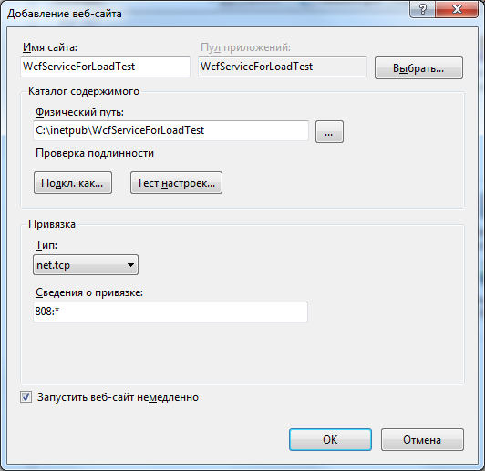

# Описание

# Настройки

## Настройка WCF-сервиса

Инструкция по настройке WCF-сервиса на **Windows 7 Корпоративная Service Pack 1 64-разрядная**.

### Шаг 0:

Установить **Visual Studio Community 2015**.

Дистрибутив доступен по ссылке: [https://www.microsoft.com/en-us/download/details.aspx?id=48146](https://www.microsoft.com/en-us/download/details.aspx?id=48146):

1. vs2015.com_enu.iso - 3.7 GB

Установить стандартный список компонент. Также можно установить Git-клиент, если его нет.

### Шаг 1:

Установить компоненты .NET:

- **Microsoft .NET Framework 3.5.1**.
 - **WCF HTTP Activation** для возможности подключения по http и https;
 - **WCF Non-HTTP Activation** для возможности подключения по net.tcp.

Установить IIS, чтобы локально развернуть wcf-сервис и провести его нагрузочное тестирование:

### Шаг 2:

Активировать возможность использования .NET 4.0 в IIS:

    C:\Windows\Microsoft.NET\Framework64\v4.0.30319\aspnet_regiis -i

По умолчанию доступен .NET 2.0.

Активировать возможность работы по протоколу net.tcp в IIS:

    C:\Windows\Microsoft.NET\Framework64\v4.0.30319\ServiceModelReg.exe -ia -v

По умолчанию в IIS работают протоколы HTTP и HTTPS.

### Шаг 3:

Запустить службу **NetTcpActivator**, позволяющую **IIS** слушать TCP-запросы.

- **NetTcpActivator** (Адаптер прослушивателя Net.Tcp)

Можно использовать командную строку:

    sc config NetTcpActivator start= auto
    net start NetTcpActivator

Или оснастку **Службы** операционной системы:

### Шаг 4:

Создать каталог для сайта:
 
    C:\inetpub\WcfServiceForLoadTest
    C:\inetpub\WcfServiceForLoadTest\App_Data

Создать новый сайт **WcfServiceForLoadTest** в оснастке **Диспетчер служб IIS**:

Добавить пользователю **IIS APPPOOL\WcfServiceForLoadTest** права на просмотр и изменение каталога `C:\inetpub\WcfServiceForLoadTest\App_Data`:

- Изменение
- Чтение и выполнение
- Список содержимого папки
- Чтение
- Запись

Разместить в каталоге `C:\inetpub\WcfServiceForLoadTest` файлы сервиса.

Файлы можно получить так:

1. Открыть проект в Visual Studio.
2. В меню выбрать пункт **Сборка** / **Опубликовать WcfLoadTest.WcfService**.
3. Выбрать, конфигурацию **Release** и опубликовать проект в каталог.
4. В проекте выбрать каталог **App_Data** в дереве проекта и выбрать пункт контекстного меню **Опубликовать App_Data**.

### Шаг 5:

Настроить SSL и привязки.

1. В оснастке **IIS** открыть корневой элемент, соответствующий серверу.
	1. Открыть элемент "**Сертификаты сервера**".
	1. Нажать **Создать самозаверенный сертификат...**.
		1. Задать понятное имя сертификата, как имя сервера. Можно воспользоваться консольной командой `hostname | clip` для копирования имени компьютера в буфер обмена.
		1. Нажать **ОК**
4. Открыть элемент, соответствующий узлу **WcfServiceForLoadTest**
	1. Нажать **Привязки..**
		1. Добавить привязку с типом **`net.tcp`**:
			* **Cведения о привязке**: `808:*`
		2. Добавить привязку с типом **`https`**:
			* **IP-адрес**: `Все назначенные`
			* **Порт**: `443`
			* **Сертификаты SSL**: выбрать сертификат сервера
		3. Добавить привязку с типом **`http`**:
			* **IP-адрес**: `Все назначенные`
			* **Порт**: `80`
			* **Имя узла**: имя сервера, можно воспользоваться консольной командой `hostname | clip`

### Шаг 6:

Проверить что службы функционируют.
Пусть сервер называется `wcfserviceforloadtest`.

Открыть ссылки для https:

* https://wcfserviceforloadtest/ServiceBasicHttp.svc
* https://wcfserviceforloadtest/ServiceNetTcp.svc
* https://wcfserviceforloadtest/ServiceSoap11.svc
* https://wcfserviceforloadtest/ServiceSoapMsBin1.svc

Открыть ссылки для http:

* http://wcfserviceforloadtest/ServiceBasicHttp.svc
* http://wcfserviceforloadtest/ServiceNetTcp.svc
* http://wcfserviceforloadtest/ServiceSoap11.svc
* http://wcfserviceforloadtest/ServiceSoapMsBin1.svc

На страницах должно быть написано, например так:

> ### ServiceBasicHttp Служба
> Служба создана.
> 
> Чтобы протестировать эту службу, необходимо создать клиент и воспользоваться им для вызова службы. Это можно сделать, запустив программу svcutil.exe из командной строки со следующим синтаксисом:

>  > `svcutil.exe http://wcfserviceforloadtest/ServiceBasicHttp.svc?wsdl`

> Доступ к описанию службы также можно получить как к одному файлу:

>  > `http://wcfserviceforloadtest/ServiceBasicHttp.svc?singleWsdl`

