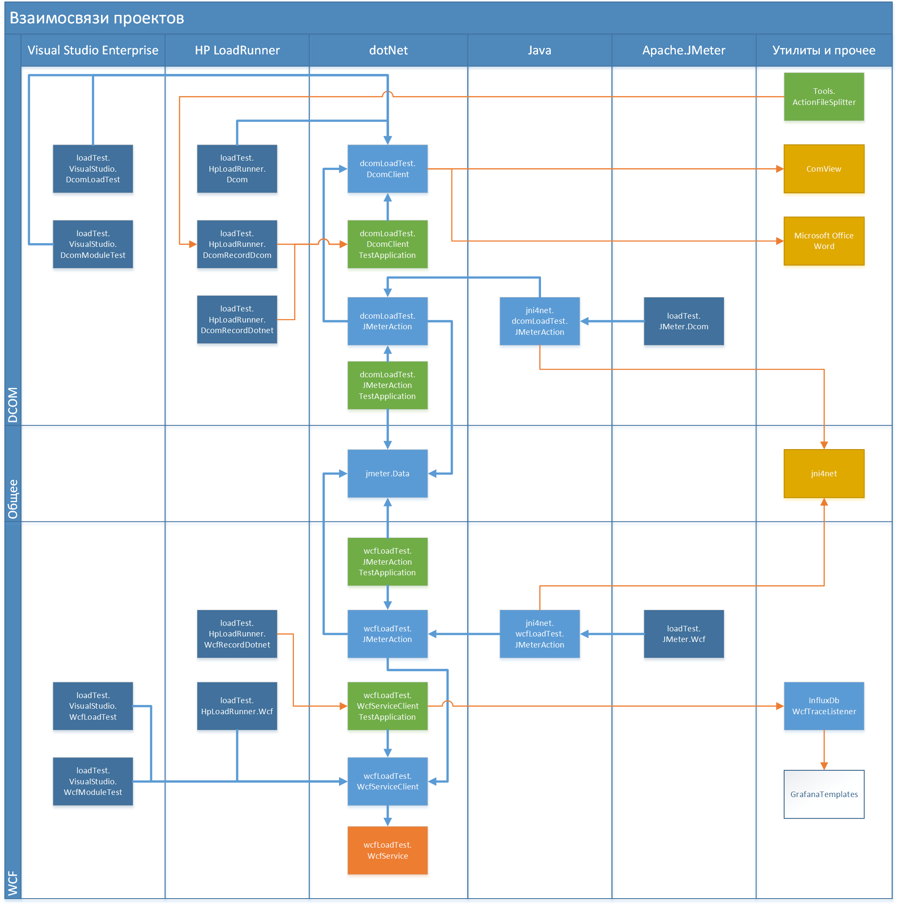
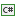
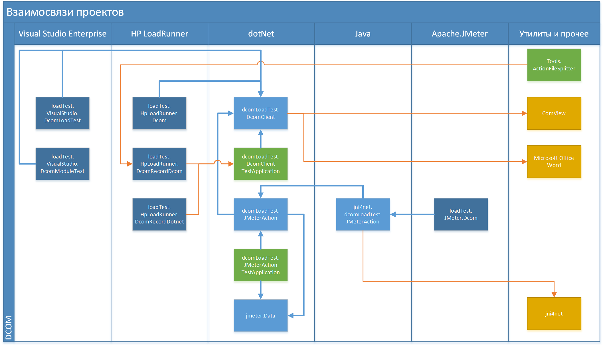
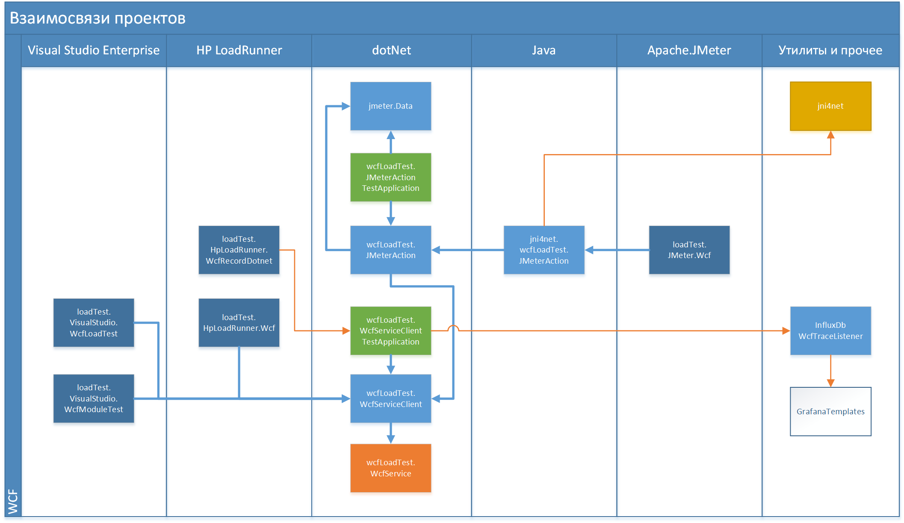

# Описание

Проект был создан для демонстрации того, что из **Apache.JMeter** можно подавать нагрузку на DCOM и WCF-сервисы. Причём даже на WCF-сервисы, которые используют в качестве протоколов *HTTP Soap/MsBin1* или *net.tcp*.

Первоначальная задача была в том, чтобы показать, что **Apache.JMeter** достаточно удобный инструмент.

Вторая задача в создании учебного примера, демонстрирующего различные подходы для разработки нагрузочных тестов для *DCOM* и *WCF* с использованием трёх популярных инструментов нагрузочного тестирования:

* **Visual Studio Enterprise** 2015;
* **HP LoadRunner** 12.53;
* **Apache.JMeter** 3.1.

# Состав проекта

Логические части проекта:

* Пример теста для DCOM;
* Пример теста для WCF;
* Документация.

Состав:

* Проекты для теста DCOM:
	1.  DcomLoadTest.DcomClient
	2.  DcomLoadTest.DcomClientTestApplication
	3.  DcomLoadTest.JMeterAction
	4.  DcomLoadTest.JMeterActionTestApplication
	5.  jni4net.dcomLoadTest.JMeterAction
	6.  loadTest.HpLoadRunner.Dcom
	7.  loadTest.HpLoadRunner.DcomRecordDcom
	8.  loadTest.HpLoadRunner.DcomRecordDotnet
	9.  loadTest.JMeter.Dcom
	10.  loadTest.VisualStudio.DcomLoadTest
	11.  loadTest.VisualStudio.DcomModuleTest
	12.  Tools.ActionFileSplitter
	13.  tools.ComView

* Проекты для теста WCF:
	1.  GrafanaTemplates
	2.  InfluxDbWcfTraceListener
	2.  jni4net.wcfLoadTest.JMeterAction
	3.  loadTest.HpLoadRunner.Wcf
	4.  loadTest.HpLoadRunner.WcfRecordDotnet
	5.  loadTest.JMeter.Wcf
	6.  loadTest.VisualStudio.WcfLoadTest
	7.  loadTest.VisualStudio.WcfModuleTest
	8.  WcfLoadTest.JMeterAction
	9.  WcfLoadTest.JMeterActionTestApplication
	10.  WcfLoadTest.WcfService
	11.  WcfLoadTest.WcfServiceClient
	12.  WcfLoadTest.WcfServiceClientTestApplication

* Документация и общие проекты:
	1.  docs
	1.  readme.md
	2.  JMeter.Data
	3.  tools.jni4net

## Проекты для теста DCOM

###  Microsoft Office Word

Это сторонний продукт из состава **Microsoft Office**.

DCOM-сервисом является приложение **Microsoft Office Word**, локально установленный. Предполагается, что он установлен и зарегистрирован на нагрузочной станции. Это приложение не является частью проекта.

DCOM-сервис используется:

1. Клиентской библиотекой **DcomLoadTest.DcomClient**.

###  tools.ComView

Это сторонняя утилита. В составе  исполняемый файл и файл справки. Сайт проекта: http://www.japheth.de/COMView.html. В данный момент сайт неактивен, но доступен по ссылкам из проекта archive.org.

Если нужно зарегистрировать или разрегистрировать другой DCOM-сервис, то может пригодиться утилита **ComView**.

От утилиты напрямую не зависят другие части проекта. Утилита является вспомогательной.

###   DcomLoadTest.DcomClient

Для взаимодействия с DCOM-сервисом из dotNet-среды, создан проект клиента на C#. В данном случае, это обёртка нам методами DCOM-сервиса, предоставляемого **Microsoft Office Word**.

Клиентская библиотека **DcomLoadTest.DcomClient** используется:

1. Тестовым приложением **DcomLoadTest.DcomClientTestApplication**.
2. Нагрузочным тестом **loadTest.HpLoadRunner.Dcom** для **HP LoadRunner**.
3. Проектом **DcomLoadTest.JMeterAction**, реализующим сценарий для **Apache.JMeter**
4. Нагрузочным тестом **loadTest.VisualStudio.DcomLoadTest** 
5. Нагрузочным тестом **loadTest.VisualStudio.DcomModuleTest**

###  DcomLoadTest.DcomClientTestApplication

Для проверки того, что проект **DcomLoadTest.DcomClient** работает и взаимодействие с **Microsoft Office Word** осуществляется корректно создано тестовое консольное приложение на C#.

Приложение **DcomLoadTest.DcomClientTestApplication** также используется для демонстрации работы Recorder-а в **HP LoadRunner Virtual User Generator**. Схема взаимодействия такая - **Virtual User Generator** запускает тестовое приложение **DcomLoadTest.DcomClientTestApplication**, перехватывает его вызовы dotNet-методов или DCOM-запросы и ответы и формирует заготовку нагрузочного скрипта.

###  DcomLoadTest.JMeterAction

Сценарии для **Apache.JMeter** реализованы в виде методов на C#, которые возвращают объект **SampleResults** из библиотеки **JMeter.Data**. Методы собраны в тестовые классы, которые собраны в виде библиотеки **DcomLoadTest.JMeterAction**.

То есть, сценарий для **JMeter** пишется для на C# в виде методов `Action*` и отлаживается в **Visual Studio**. Методы называются `Action`, для единообразия с тестами **HP LoadRunner**. А **Jmeter** вызывает Action-методы dll-библиотеки, при выполнении которых создаётся нагрузка на тестируемый DCOM-сервис. Action-методы возвращают статистику по выполнению каждого запроса к DCOM-сервису. И **JMeter** отображает транзакции из сценария, как подзапросы.

###  DcomLoadTest.JMeterActionTestApplication
  
Для отладки сценариев для Apache.JMeter в Visual Studio нужна простая программа, вызывающая методы Action-методы.
**DcomLoadTest.JMeterActionTestApplication** - простая программа, которая используется для отладки Action-методов в **Visual Studio**.

###  jni4net.dcomLoadTest.JMeterAction

Apache.JMeter штатными средствами может вызывать методы из java-классов, а также исполняемые файлы. То есть, можно подавать нагрузку запуском **DcomLoadTest.JMeterActionTestApplication**. Для того, чтобы вызывать Action-методы, реализованные в dotNet библиотеке, с помощью jni4net создаётся java-класс-обёртка 

## Пример теста для WCF

